# AI Contract / Legal Document Simplifier

> **"Understand your legal documents before you sign."**  
> Transform complex contracts, leases, and agreements into clear plain-language explanations, automated risk assessments, document-grounded AI Q&A, standard benchmark comparisons, and executive PDF reports.

[](https://www.python.org/)
[](https://fastapi.tiangolo.com/)
[](https://react.dev/)
[](https://www.typescriptlang.org/)
[](https://vitejs.dev/)
[](https://www.sqlalchemy.org/)
[](https://www.postgresql.org/)
[](https://www.sqlite.org/)
[](https://www.reportlab.com/)
[-success?style=flat-square&logo=pytest&logoColor=white)](backend/app/tests)

---

## 📋 Table of Contents

- [Project Overview](#-project-overview)
- [Problem Statement](#-problem-statement)
- [Solution Workflow](#-solution-workflow)
- [System Architecture](#-system-architecture)
- [Core SRS Features](#-core-srs-features)
  - [1. Document Upload & Validation](#1-document-upload--validation)
  - [2. Clause Extraction & Parsing](#2-clause-extraction--parsing)
  - [3. Risk Flagging & Severity Classification](#3-risk-flagging--severity-classification)
  - [4. Plain-Language Explanations & Rationale](#4-plain-language-explanations--rationale)
  - [5. Risk-Level Summary Dashboard](#5-risk-level-summary-dashboard)
  - [6. Document-Grounded AI Chat (RAG)](#6-document-grounded-ai-chat-rag)
  - [7. Interactive Clause Highlighting & Navigation](#7-interactive-clause-highlighting--navigation)
- [Advanced / Stretch Features](#-advanced--stretch-features)
  - [SRS-S01: Side-by-Side Clause Comparison](#srs-s01-side-by-side-clause-comparison)
  - [SRS-S02: Standard Clause Benchmark Comparison](#srs-s02-standard-clause-benchmark-comparison)
  - [SRS-S03: Downloadable Executive PDF Report](#srs-s03-downloadable-executive-pdf-report)
  - [SRS-S04: Multi-Document Type Support](#srs-s04-multi-document-type-support)
- [How It Works (User Journey)](#-how-it-works-user-journey)
- [Database Schema & Data Models](#-database-schema--data-models)
- [AI & RAG Pipeline Deep Dive](#-ai--rag-pipeline-deep-dive)
- [REST API Reference](#-rest-api-reference)
- [Security, Privacy & Isolation](#-security-privacy--isolation)
- [Technology Stack](#-technology-stack)
- [Local Setup & Installation](#-local-setup--installation)
- [Test Suite & Quality Assurance](#-test-suite--quality-assurance)
- [Legal Disclaimer](#-legal-disclaimer)

---

## 📖 Project Overview

Legal contracts govern everyday personal and business decisions. Individuals, freelancers, tenants, and small business owners routinely sign critical agreements without full comprehension of the obligations and liabilities they contain:

- **Residential Leases / Rental Agreements**: Automatic multi-year renewal lock-ins, excessive repair deductions, immediate eviction clauses, and 24-hour entry forfeitures.
- **Freelance & Contractor Agreements**: Unilateral blanket indemnities, unconditional intellectual property forfeiture prior to payment, and unlimited consequential liability.
- **Terms of Service & Privacy Policies**: Mandatory binding arbitration, unilateral terms modification without notice, and broad data licensing provisions.
- **Commercial Vendor Contracts**: Hidden price escalations, non-compete covenants, and ambiguous cure periods.

**LexAI Legal Simplifier** is an AI-powered contract analysis platform that analyzes the user's **actual uploaded document**, extracts verbatim provisions, evaluates risks, compares clauses against balanced commercial benchmarks, and allows users to ask grounded questions directly against their contract.

> ⚠️ **Important:** This system is an analytical and educational aid designed to make contractual language easier to understand. It does not provide formal legal advice or substitute for a licensed attorney.

---

## 🛑 Problem Statement

1. **Dense Legalese & Asymmetric Information**: Legal prose is intentionally dense, making it difficult for non-lawyers to spot unfavorable or non-standard provisions before signing.
2. **Generic Advice is Ineffective**: Generic internet articles explaining *"What to look for in a lease"* cannot identify the exact risks, deadlines, and penalty clauses contained in a specific agreement.
3. **High Cost of Legal Consultation**: Retaining legal counsel for routine consumer and freelance contracts is often cost-prohibitive.
4. **AI Hallucinations in Legal Contexts**: Unconstrained general-purpose AI chat tools often hallucinate clauses, cite non-existent laws, or assume facts outside the contract.

**LexAI** solves this by constraining AI reasoning strictly to the uploaded contract text, computing factual metrics from stored clause records, and anchoring every finding to verbatim document coordinates.

---

## 💡 Solution Workflow

```
┌─────────────────────────┐
│ User Uploads Contract   │ (PDF or TXT, up to 25 MB)
└───────────┬─────────────┘
            │
            ▼
┌─────────────────────────┐
│  Validation & Security  │ (MIME, size, extension, filename sanitization)
└───────────┬─────────────┘
            │
            ▼
┌─────────────────────────┐
│ Page & Text Extraction  │ (pdfplumber page-by-page mapping + char offsets)
└───────────┬─────────────┘
            │
            ▼
┌─────────────────────────┐
│ Clause & Section Parser │ (Regex section boundaries, paragraph chunking)
└───────────┬─────────────┘
            │
            ▼
┌─────────────────────────┐
│ LLM Risk & Simplifier   │ (Pydantic-validated JSON: HIGH, MEDIUM, LOW)
└───────────┬─────────────┘
            │
            ▼
┌─────────────────────────┐
│ Database Persistence    │ (Strict count calculation & transactional commits)
└───────────┬─────────────┘
            │
            ├──────────────────────────┬──────────────────────────┐
            ▼                          ▼                          ▼
┌────────────────────────┐ ┌────────────────────────┐ ┌────────────────────────┐
│ Interactive Dashboard  │ │ Grounded AI Chat (RAG) │ │ Benchmark Comparison   │
│ • Risk metrics & cards │ │ • Scoped vector search │ │ • Deviation analysis   │
│ • Side-by-Side view    │ │ • Evidence constraint  │ │ • Similarity scoring   │
│ • Verbatim highlighting│ │ • Source citations     │ │ • Difference breakdown │
└────────────────────────┘ └────────────────────────┘ └────────────────────────┘
            │                          │                          │
            └──────────────────────────┼──────────────────────────┘
                                       │
                                       ▼
                         ┌───────────────────────────┐
                         │ Executive PDF Risk Report │ (ReportLab download)
                         └───────────────────────────┘
```

---

## 🏗️ System Architecture

```mermaid
flowchart TD
    subgraph Client["Frontend (React 19 + TypeScript + Vite)"]
        UI_Upload["FileDropZone & UploadBox"]
        UI_Dashboard["Dashboard & DocumentAnalysisPage"]
        UI_Viewer["DocumentViewer (Verbatim Highlight)"]
        UI_List["ClauseList & Risk Filters"]
        UI_Detail["ClauseDetail (Side-by-Side View)"]
        UI_Chat["ContractChatPanel (Citations)"]
        UI_Comp["StandardClauseComparison"]
    end

    subgraph Backend["Backend API (FastAPI + Python 3.11+)"]
        API_Doc["/api/documents (Upload & Text)"]
        API_Analysis["/api/documents/{id}/analyze"]
        API_Chat["/api/documents/{id}/chat"]
        API_Comp["/api/documents/{id}/compare"]
        API_Report["/api/documents/{id}/report"]

        Service_Extract["ExtractionService (pdfplumber)"]
        Service_Clause["ClauseExtractionService (Regex)"]
        Service_Pipeline["AnalysisPipeline (Orchestrator)"]
        Service_LLM["LLMService (OpenAI / Gemini / Mock)"]
        Service_RAG["RAGService & ChunkingService"]
        Service_Embed["EmbeddingService (Cosine Sim)"]
        Service_Benchmark["ComparisonService (Templates)"]
        Service_PDF["ReportGenerator (ReportLab)"]
    end

    subgraph Storage["Database Layer (SQLAlchemy 2.0)"]
        DB[(PostgreSQL / Supabase / SQLite WAL)]
        T_Doc["documents & document_pages"]
        T_Clause["clauses & analysis_summaries"]
        T_Chunk["document_chunks (vectors)"]
        T_Chat["chat_sessions, messages, sources"]
        T_Comp["standard_templates, clauses, comparisons"]
    end

    UI_Upload --> API_Doc
    UI_Dashboard --> API_Analysis
    UI_Viewer <--> UI_List
    UI_Chat --> API_Chat
    UI_Comp --> API_Comp
    UI_Dashboard --> API_Report

    API_Doc --> Service_Extract --> T_Doc
    API_Analysis --> Service_Pipeline
    Service_Pipeline --> Service_Clause
    Service_Pipeline --> Service_LLM
    Service_Pipeline --> T_Clause

    API_Chat --> Service_RAG
    Service_RAG --> Service_Embed --> T_Chunk
    Service_RAG --> Service_LLM --> T_Chat

    API_Comp --> Service_Benchmark
    Service_Benchmark --> Service_LLM --> T_Comp

    API_Report --> Service_PDF
    Service_PDF --> T_Doc
    Service_PDF --> T_Clause
```



---

## 🎯 Core SRS Features

### 1. Document Upload & Validation
- **Multi-Format Ingestion**: Supports `.pdf` files via `pdfplumber` and plain text `.txt` files via UTF-8/Latin-1 fallback.
- **Strict Pre-Upload Validation** (`backend/app/utils/file_validation.py`):
  - **Size Limit**: Enforces a strict 25 MB file size limit (`MAX_FILE_SIZE_BYTES = 26214400`).
  - **MIME & Extension Whitelist**: Verifies extensions (`.pdf`, `.txt`) and MIME headers (`application/pdf`, `text/plain`).
  - **Path Traversal Protection**: Sanitizes file names using `sanitize_filename()` to prevent directory traversal attacks.
  - **Empty / Corrupt File Rejection**: Rejects zero-byte files and PDFs with zero extractable pages with descriptive error messages.
- **Page-by-Page Offsets**: Records `char_start` and `char_end` relative to the document text for high-fidelity viewer mapping.

### 2. Clause Extraction & Parsing
- **Structural Boundary Detection** (`backend/app/services/clause_extraction.py`):
  - Identifies numbered sections (`"Section 8.2 Termination"`, `"1.1 Scope of Work"`, `"Article IV"`).
  - Detects standalone uppercase headings (`"MUTUAL INDEMNIFICATION"`, `"GOVERNING LAW"`).
  - Parses paragraph blocks while maintaining absolute character coordinates and page numbers.
- **Verbatim Text Preservation**: Stores exact, unedited contract text in the `clauses` database table to preserve legal fidelity.

### 3. Risk Flagging & Severity Classification
Every candidate clause is submitted to structured LLM evaluation and classified into one of three strict levels:
- 🔴 **HIGH Risk**:
  - Broad unilateral indemnities and hold-harmless provisions
  - Unlimited or uncapped liability
  - Unilateral termination without cause or notice
  - Automatic multi-year renewal lock-ins with short cancellation windows
  - Complete waiver of jury trial, class action, or statutory tenant/contractor rights
  - Restrictive post-employment non-compete or non-solicitation covenants
- 🟡 **MEDIUM Risk**:
  - Unilateral modification clauses with short or discretionary notice
  - Strict procedural notification timelines (e.g. 3-day notice window)
  - Specific or restrictive dispute resolution venues / mandatory arbitration
  - Ambiguous renewal terms requiring proactive cancellation
- 🟢 **LOW Risk**:
  - Standard definitions and preamble boilerplate
  - Fair, bilateral notice periods (30–60 days)
  - Customary payment terms (e.g. Net 30 with standard grace periods)
  - Standard mutual confidentiality provisions

### 4. Plain-Language Explanations & Rationale
For every analyzed clause, the system generates two distinct analytical outputs:
- **"What this means"**: A simplified plain-language translation written in clear terms for non-lawyers, using cautious, informative phrasing (*"This clause states that..."*, *"Under this term, you may be required to..."*).
- **"Why this was flagged"**: The underlying legal risk rationale explaining why the provision represents a potential concern or imbalance.

### 5. Risk-Level Summary Dashboard
- **Dynamic Risk Metric Aggregation**: Aggregates `HIGH`, `MEDIUM`, `LOW`, and `TOTAL` clause counts strictly from persisted database records (`analysis_summaries` and `clauses`).
- **Executive Overview**: A 2–4 sentence plain-language summary highlighting the overall risk posture and primary action items for the user before signing.

### 6. Document-Grounded AI Chat (RAG)
An isolated Retrieval-Augmented Generation (RAG) engine that enables users to query their contract:
```
User Question
     │
     ▼
Query Embedding (OpenAI / Deterministic Semantic Mock)
     │
     ▼
Document-Scoped Vector Search (WHERE document_id = :id)
     │
     ▼
Top-K Relevant Chunks & Clauses
     │
     ▼
Strict Grounding System Prompt
     │
     ▼
Factual Answer + Interactive Citation Badges (Section · Page ↗)
```
- **Strict Evidence Constraint**: The LLM is instructed via `RAG_SYSTEM_PROMPT` to rely **only** on provided document chunks and to avoid external general legal speculation.
- **Unsupported Query Fallback**: If a question asks about details, laws, or terms not present in the contract, the system responds:  
  `"I couldn't find this information in the uploaded document."`
- **Interactive Source Citations**: Every answer includes clickable citation pills with section numbers, page references, and relevance scores.

### 7. Interactive Clause Highlighting & Navigation
- **Click-to-Navigate**: Clicking any clause card in the risk list or citation pill in the AI chat automatically switches the document viewer to the correct page.
- **Smooth Auto-Scroll**: Scrolls the exact clause into view with visual bounding and highlight animation.
- **Bidirectional Linking**: Clicking an area in the document viewer highlights the corresponding clause breakdown card in the analysis column.

---

## 🚀 Advanced / Stretch Features

### SRS-S01: Side-by-Side Clause Comparison
The `ClauseDetail` component (`frontend/src/components/ClauseDetail.tsx`) provides a dual-column comparison view:
- **Left Column**: Verbatim contract language with section number, title, and page badge.
- **Right Column**: Plain-language simplified translation, risk level badge, and legal rationale breakdown.

```
┌───────────────────────────────────────┬───────────────────────────────────────┐
│        ORIGINAL CONTRACT TEXT         │       PLAIN-LANGUAGE SIMPLIFIED       │
├───────────────────────────────────────┼───────────────────────────────────────┤
│ "Section 12.2: Tenant shall defend,   │ 💡 What this means:                   │
│ indemnify, and hold harmless Landlord │ You agree to pay for any legal fees   │
│ from any and all claims, liabilities, │ and damages against the landlord, even│
│ damages, or losses arising on the     │ if the issue was not your fault.      │
│ premises regardless of cause..."      │                                       │
│                                       │ ⚠️ Why this was flagged (HIGH RISK):   │
│                                       │ Creates broad, one-sided liability    │
│                                       │ without excluding landlord negligence.│
└───────────────────────────────────────┴───────────────────────────────────────┘
```

---

### SRS-S02: Standard Clause Benchmark Comparison
The benchmark comparison engine (`backend/app/services/comparison_service.py` & `frontend/src/components/StandardClauseComparison.tsx`) evaluates contract clauses against standard, balanced commercial templates:

```
Contract Clause ───► Category Matcher ───► Standard Benchmark ───► LLM Comparison Engine
                                                                        │
                                ┌───────────────────────────────────────┴───────────────────────────────────────┐
                                ▼                                       ▼                                       ▼
                       Deviation Level                         Similarity Score                          Difference Breakdown
                     (LOW | MEDIUM | HIGH)                        (0.00 – 1.00)                        (Specific Bullet Points)
```

#### Supported Document Types & Benchmark Categories:
| Document Type | Benchmark Template | Standard Clause Categories |
| :--- | :--- | :--- |
| **Rental Agreement** | Standard Residential Lease Benchmark (v1.0) | `PAYMENT`, `SECURITY_DEPOSIT`, `TERMINATION`, `RENEWAL`, `MAINTENANCE`, `ENTRY`, `LIABILITY` |
| **Freelance Contract** | Standard Independent Contractor Benchmark (v1.0) | `PAYMENT`, `INTELLECTUAL_PROPERTY`, `TERMINATION`, `CONFIDENTIALITY`, `LIABILITY`, `SCOPE` |
| **Terms of Service** | Standard Online Terms of Service Benchmark (v1.0) | `TERMINATION`, `PAYMENT`, `LIABILITY`, `INTELLECTUAL_PROPERTY`, `DISPUTE_RESOLUTION`, `MODIFICATION` |
| **Other / General** | General Commercial Contract Benchmark (v1.0) | `PAYMENT`, `TERMINATION`, `CONFIDENTIALITY`, `LIABILITY` |

> ℹ️ **Informational Purpose:** Benchmark comparisons illustrate how clauses differ from balanced commercial conventions. A deviation does not necessarily indicate that a clause is unlawful.

---

### SRS-S03: Downloadable Executive PDF Report
Built with `ReportLab` (`backend/app/services/report_generator.py`), users can download an executive PDF risk summary report via `GET /api/documents/{id}/report`:
- **Header & Metadata**: Document name, contract classification, timestamp, and generation ID.
- **Risk Scorecard Table**: Formatted count boxes for Total, High, Medium, and Low risk findings.
- **Executive Summary Box**: High-level contract risk overview.
- **Clause Breakdown**: Full table of categorized clauses, original text snippets, risk levels, and explanations.
- **Mandatory Legal Disclaimer**: Included on every generated report.

---

### SRS-S04: Multi-Document Type Support
Users can classify their contract during upload into one of four supported document types:
1. **Rental Agreement**
2. **Freelance Contract**
3. **Terms of Service**
4. **Other (General Commercial)**

The selected classification informs the benchmark template selection, category keyword matching heuristics, and RAG retrieval context.

---

## 🔄 How It Works (User Journey)

```
1. UPLOAD CONTRACT
   └── Drag & drop a PDF or TXT file on the Upload Page.
   └── Select document type (e.g. "Rental Agreement").

2. AUTOMATED EXTRACTION & ANALYSIS
   └── System validates file, extracts pages, and detects clause boundaries.
   └── AI analyzes each clause, assigns risk levels, and generates explanations.
   └── Benchmark comparison engine matches clauses against standard templates.

3. REVIEW EXECUTIVE DASHBOARD
   └── View total clause count and risk metric scorecards (High, Medium, Low).
   └── Read the 2-4 sentence executive overview of main contract considerations.

4. EXPLORE & FILTER FINDINGS
   └── Filter clauses by risk level (ALL, HIGH, MEDIUM, LOW) or search keywords.
   └── Click any clause card to highlight verbatim text in the Document Viewer.

5. INSPECT SIDE-BY-SIDE TRANSLATIONS
   └── Review original verbatim text side-by-side with plain-language explanations.
   └── Inspect the specific legal reasoning behind every risk flag.

6. EVALUATE BENCHMARK COMPARISONS
   └── Switch to the "⚖️ Benchmarks" tab to inspect deviation ratings and similarity scores.
   └── Review specific bullet points identifying how the clause differs from industry standards.

7. INTERACTIVE GROUNDED AI CHAT
   └── Switch to the "💬 Ask AI" tab to ask questions about the contract.
   └── Click citation pills (e.g., Section 4.1 · Page 2 ↗) to navigate directly to cited text.

8. EXPORT EXECUTIVE PDF REPORT
   └── Click "📄 Download PDF Report" to export a professional risk analysis report.
```

---

## 🗄️ Database Schema & Data Models

The relational schema is implemented with SQLAlchemy 2.0 and supports PostgreSQL / Supabase and SQLite:

```
┌────────────────────────────────┐       ┌────────────────────────────────┐
│           documents            │1     N│         document_pages         │
├────────────────────────────────┼───────┼────────────────────────────────┤
│ id (PK, UUID)                  │       │ id (PK, UUID)                  │
│ filename (VARCHAR)             │       │ document_id (FK -> documents)  │
│ document_type (VARCHAR)        │       │ page_number (INT)              │
│ file_type (pdf | txt)          │       │ text (TEXT)                    │
│ file_size (BIGINT)             │       │ char_start, char_end (BIGINT)  │
│ status (UPLOADED/ANALYZED/...) │       └────────────────────────────────┘
└───────────────┬────────────────┘
                │1
                ├────────────────────────┬────────────────────────────────┐
                │N                       │1                               │N
                ▼                        ▼                                ▼
┌────────────────────────────────┐ ┌────────────────────────────────┐ ┌────────────────────────────────┐
│            clauses             │ │       analysis_summaries       │ │        document_chunks         │
├────────────────────────────────┤ ├────────────────────────────────┤ ├────────────────────────────────┤
│ id (PK, UUID)                  │ │ id (PK, UUID)                  │ │ id (PK, UUID)                  │
│ document_id (FK -> documents)  │ │ document_id (FK, UNIQUE)       │ │ document_id (FK -> documents)  │
│ section_number (VARCHAR)       │ │ total_clauses (INT)            │ │ clause_id (FK -> clauses)      │
│ section_title (VARCHAR)        │ │ high_count, med_count, low_cnt │ │ page_number (INT)              │
│ clause_text (TEXT)             │ │ overall_summary (TEXT)         │ │ chunk_text (TEXT)              │
│ risk_level (LOW/MEDIUM/HIGH)   │ └────────────────────────────────┘ │ embedding (JSONB / Array)      │
│ explanation, reason (TEXT)     │                                    └────────────────────────────────┘
│ page_number (INT)              │
│ char_start, char_end (BIGINT)  │
└───────────────┬────────────────┘
                │1
                ├─────────────────────────────────────────────────────────┐
                │N                                                        │N
                ▼                                                         ▼
┌────────────────────────────────┐       ┌────────────────────────────────┐
│       clause_comparisons       │       │          chat_sources          │
├────────────────────────────────┤       ├────────────────────────────────┤
│ id (PK, UUID)                  │       │ id (PK, UUID)                  │
│ document_id (FK -> documents)  │       │ message_id (FK -> chat_message)│
│ clause_id (FK -> clauses)      │       │ clause_id (FK -> clauses)      │
│ standard_clause_id (FK)        │       │ page_number (INT)              │
│ deviation_level (LOW/MED/HIGH) │       │ relevance_score (FLOAT)        │
│ similarity_score (FLOAT)       │       └────────────────────────────────┘
│ comparison_summary (TEXT)      │
│ differences (JSONB)            │
└────────────────────────────────┘
```

---

## 🤖 AI & RAG Pipeline Deep Dive

### Provider Agnostic Architecture (`backend/app/services/llm_service.py`)
- **OpenAI Provider**: Supports `gpt-4o`, `gpt-4o-mini`, and OpenAI-compatible endpoints (Groq, vLLM, Ollama).
- **Gemini Provider**: Supports `gemini-1.5-flash` and `gemini-1.5-pro` via REST endpoints.
- **Intelligent Offline Mock Provider**: Deterministic heuristic risk analyzer and semantic keyword comparison engine allowing full offline operation and zero-network test execution.

### Robust JSON Extraction & Schema Validation
All LLM responses pass through `extract_json_from_text()` with automatic markdown stripping, bracket balancing, and trailing-comma repair, followed by strict Pydantic validation:
```python
class LLMClauseItem(BaseModel):
    section_number: Optional[str] = None
    section_title: Optional[str] = None
    clause_text: str
    risk_level: RiskLevel  # Strict Enum: LOW | MEDIUM | HIGH
    explanation: str
    reason: str
    page_number: Optional[int] = 1
```

---

## 🔌 REST API Reference

| Method | Endpoint | Description | Status Code |
| :--- | :--- | :--- | :--- |
| `GET` | `/api/health` | Service health status and version | `200 OK` |
| `POST` | `/api/documents/upload` | Upload and extract PDF or TXT contract | `201 Created` |
| `GET` | `/api/documents/{id}` | Retrieve document metadata and processing status | `200 OK` |
| `GET` | `/api/documents/{id}/text` | Get page-by-page extracted text and offsets | `200 OK` |
| `DELETE`| `/api/documents/{id}` | Delete document and all cascading data | `204 No Content` |
| `POST` | `/api/documents/{id}/analyze` | Execute AI clause extraction & risk assessment | `200 OK` |
| `GET` | `/api/documents/{id}/summary` | Retrieve aggregated risk counts and summary | `200 OK` |
| `GET` | `/api/documents/{id}/clauses` | List clauses with search, pagination, and risk filters | `200 OK` |
| `GET` | `/api/documents/{id}/clauses/{clause_id}` | Retrieve detailed information for a single clause | `200 OK` |
| `POST` | `/api/documents/{id}/chat` | Ask a grounded question about the contract | `200 OK` |
| `GET` | `/api/documents/{id}/chat/history` | Get chat history and source citations for a session | `200 OK` |
| `POST` | `/api/documents/{id}/compare` | Execute standard benchmark clause comparison | `200 OK` |
| `GET` | `/api/documents/{id}/comparisons` | Retrieve stored comparisons with deviation filtering | `200 OK` |
| `GET` | `/api/benchmarks/templates` | List all standard benchmark templates | `200 OK` |
| `GET` | `/api/documents/{id}/report` | Download executive PDF risk report | `200 OK (PDF)` |

Interactive Swagger documentation is available at `http://localhost:8000/api/docs`.

---

## 🛡️ Security, Privacy & Isolation

- **Document Isolation**: All vector embeddings, chat histories, clause extractions, and comparisons are strictly partitioned by `document_id`. Cross-document data leakage is prevented at both the query and API layers.
- **Zero Hardcoded Secrets**: All API keys, connection strings, and configuration settings are loaded dynamically via `pydantic-settings` from `.env` files.
- **SQL Injection Prevention**: Built entirely with SQLAlchemy 2.0 ORM parameterization.
- **CORS Protection**: Restricted to explicit allowed origins (`http://localhost:5173`, `http://localhost:3000`).
- **Input Sanitization**: File uploads undergo MIME inspection, file signature validation, and character sanitization.

---

## 💻 Technology Stack

| Component | Technology | Description |
| :--- | :--- | :--- |
| **Backend Framework** | **FastAPI 0.115** | High-performance asynchronous Python API framework |
| **Language Runtime** | **Python 3.11+** | Modern typed Python with native asyncio support |
| **ORM & Database** | **SQLAlchemy 2.0 / AsyncPG** | Async ORM supporting PostgreSQL, Supabase, and SQLite WAL |
| **PDF Extraction** | **pdfplumber 0.11** | Accurate PDF page extraction and character coordinate mapping |
| **PDF Generation** | **ReportLab** | Document generation engine for executive PDF reports |
| **AI / LLM Integration**| **OpenAI / Gemini / Mock** | Multi-provider LLM abstraction with schema enforcement |
| **Validation Layer** | **Pydantic v2** | Strict data validation and settings management |
| **Frontend Framework** | **React 19 & Vite 8** | Modern UI framework with fast hot module replacement |
| **Language (Frontend)**| **TypeScript 5.6** | Static typing for enterprise UI safety |
| **Routing & Network** | **React Router v7 / Axios** | Client-side routing and HTTP communication |
| **Testing Suite** | **pytest & pytest-asyncio** | Automated unit, integration, and end-to-end testing |

---

## ⚡ Local Setup & Installation

### Prerequisites
- **Python 3.11+**
- **Node.js 18+** & **npm**
- **PostgreSQL 14+** (Optional — SQLite WAL mode works out of the box for local development)

### 1. Clone the Repository
```bash
git clone https://github.com/naveesh-007/AI_Contract_Analyzer.git
cd AI_Contract_Analyzer
```

### 2. Backend Setup
```bash
cd backend

# Create and activate virtual environment
python -m venv .venv

# On Windows:
.venv\Scripts\activate
# On macOS/Linux:
source .venv/bin/activate

# Install dependencies
pip install -r requirements.txt

# Configure environment variables
cp .env.example .env
```

Edit `backend/.env` with your preferred configuration:
```env
DATABASE_URL=sqlite+aiosqlite:///./lexai.db
LLM_PROVIDER=openai
LLM_API_KEY=your_openai_or_gemini_api_key
LLM_MODEL=gpt-4o-mini
CORS_ORIGINS=["http://localhost:5173","http://localhost:3000"]
```
*(Note: If `LLM_API_KEY` is omitted, the system operates seamlessly using the built-in offline mock provider).*

Start the backend server:
```bash
uvicorn app.main:app --reload --host 0.0.0.0 --port 8000
```
- API Documentation: `http://localhost:8000/api/docs`
- Health Check: `http://localhost:8000/api/health`

### 3. Frontend Setup
```bash
# In a new terminal window:
cd frontend

# Install dependencies
npm install

# Start Vite dev server
npm run dev
```
Open your browser at `http://localhost:5173`.

---

## 🧪 Test Suite & Quality Assurance

The repository includes a comprehensive test suite covering unit, integration, and end-to-end workflows:

```bash
cd backend
pytest -v
```

### Test Coverage Highlights:
- ✅ `test_upload.py`: File validation, MIME detection, 25MB limits, empty file handling.
- ✅ `test_clauses.py`: Regex header parsing, verbatim offset mapping, clause listing.
- ✅ `test_analysis.py`: LLM pipeline, retry mechanics, schema validation, summary calculation.
- ✅ `test_chat.py`: Scoped RAG retrieval, grounded answering, source citation persistence, fallback messages.
- ✅ `test_comparison.py`: Benchmark matching, deviation levels, similarity scores, difference bullet points.
- ✅ `test_e2e.py`: Complete document lifecycle from upload to analysis, comparison, chat, and report generation.

---

## ⚖️ Legal Disclaimer

> **LexAI Legal Simplifier** is an artificial intelligence application designed solely for informational, educational, and document-navigation purposes.
>
> - **Not Legal Advice**: This application does not provide formal legal advice, legal opinions, or professional legal recommendations.
> - **No Attorney-Client Relationship**: Use of this software does not create an attorney-client relationship.
> - **Consult Legal Counsel**: Contractual laws vary by jurisdiction. Users should always consult a licensed attorney or legal professional before signing or taking action based on legal agreements.
